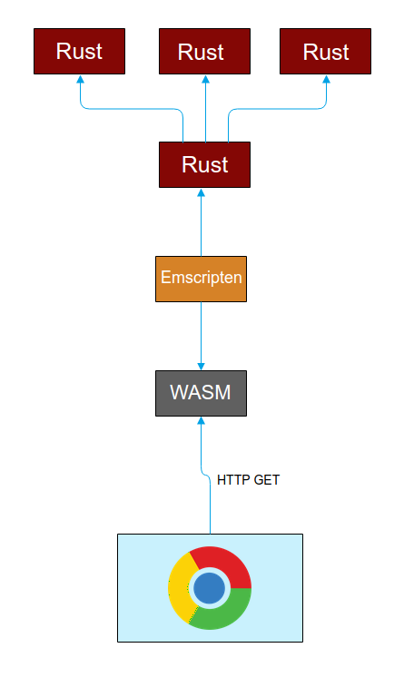
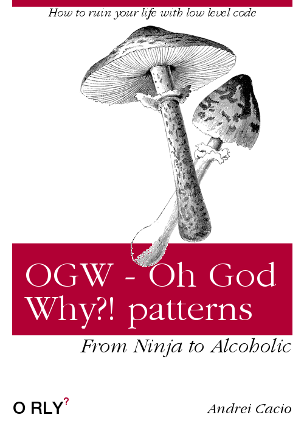

# WebAssembly for JavaScritp Developers

## What is WebAssembly?

WebAssembly is a compilation target for "lower level" languages like: C/C++/Rust (and others). This means that we can compile non-JS programs and run them in the browser.

## Why the need?

Because of JavaScript's dynamic nature you cannot bypass all the optimization process done by the engine. Even though JavaScritp is pretty fast we can still have things even ⚡ faster ⚡.

### A theoretical representation of how a JavaScript engine handles our JavaScript code:


### And how it theoretically handles the WebAssembly code

(Images above courtesy of [Lin Clark](https://2r4s9p1yi1fa2jd7j43zph8r-wpengine.netdna-ssl.com/files/2017/02/05-03-diagram_future01.png))

## How does all of this work?


### Key concepts (3 out of 4)
The `WebAssembly` namespace
1. Module: The compiled wasm representation.
2. Instance: The actual module with all the functions exported.
3. Memory
The first shared layer between our JavaScript environment and our WASM module is the memory. WebAssembly manages state threw a linear memory represented by an [`ArrayBuffer`](https://developer.mozilla.org/en-US/docs/Web/JavaScript/Reference/Global_Objects/ArrayBuffer).
`ArrayBuffer`'s on their own are an intermediate representation of a blob of raw byte data. To work with this blob we will need a way shape it to our needs. Entering: [`TypedArrays`](https://developer.mozilla.org/en-US/docs/Web/JavaScript/Typed_arrays). 


```javascript
const rawBuff = new ArrayBuffer(16);
const view8 = new Uint8Array(rawBuff);
const view32 = new Uint32Array(rawBuff);

view32[0] = 1;
view32[1] = 2;
```

## Tooling
*Disclaimer: pros/cons from a newbie's point of view. Highly experienced proffesionals may have a different perspective*

### [Emscripten](https://users.rust-lang.org/t/compiling-to-the-web-with-rust-and-emscripten/7627)

pros:
- battle tested

cons:
- steep learning curve
- overwhelming docs
- setting up everything can be awkward

### [native-wasm-target](https://www.hellorust.com/news/native-wasm-target.html)
pros:
- no extra tooling, just the Rust compiler
- [`wasm-bindgen`](https://rustwasm.github.io/wasm-bindgen) a more high level approach of **JS ⇔ wasm** interaction
- easy setup

cons:
- bleeding edge-ish, still under development (need Rust beta)

### Rust
#### The ecosystem
- [rustup](https://rustup.rs/) Similar to npm's NVM, it is a way to simply switch between Rust versions
- [cargo](https://crates.io/) Similar to npm, cargo is the official package manager for Rust
- [rustc](https://doc.rust-lang.org/rustc/what-is-rustc.html) Rust's compiler

#### The language
Everything is immutable by default.

#### Two out of three (ain't bad) key concepts of the language:
- ownership
example:
```rust
fn print_vec(vec: Vec<i32>) {
	println!("{:?}", vec);	
}

fn main() {
	let vec = vec![1, 2, 3, 4];
	print_vec(vec);
	print_vec(vec);
}
```
- borrowing
```rust
fn print_vec(vec: &Vec<i32>) {
	println!("{:?}", vec);	
}

fn main() {
	let vec = vec![1, 2, 3, 4];
	print_vec(&vec);
	print_vec(&vec);
}
```

### Our arsenal for tackling WebAssembly ([docs](https://rustwasm.github.io/book/game-of-life/setup.html))
- [`wasm-pack`](https://github.com/rustwasm/wasm-pack) The superhero in our movie. This tool manages our workflow and helps us create, build and ship WebAssembly code
- [`cargo-generate`](https://github.com/ashleygwilliams/cargo-generate) This tool will generate us a Rust boilerplate project just to get us started fast.
- [`wasm-bindgen`](https://rustwasm.github.io/wasm-bindgen) Our second superhero in our movie. This bad boy will be our main tour guide from Rust world to JS world and back.
- `npm` Needs no intro
- `webpack 4` Also needs no introduction

### WASM and JS
Two official patterns for communicating between JavaScript and WASM:
1. OGW
<details><summary>Book comming soon</summary>
<p>

</p>
2. KOSBIT

#### Some common interactions
1. Exporting and executing Rust functions in JavaScript
2. Calling JavaScript functions in Rust
3. Reading an array from Rust
4. Communicating with complex data structures

## References
1. [Rust Book - Ownership](https://doc.rust-lang.org/1.8.0/book/ownership.html)
2. [Rust Book - References & Borrowing](https://doc.rust-lang.org/1.8.0/book/references-and-borrowing.html)
3. [What makes WebAssembly fast - Lin Clark](https://hacks.mozilla.org/2017/02/what-makes-webassembly-fast/)
4. [WebAssembly Concepts](https://developer.mozilla.org/en-US/docs/WebAssembly/Concepts)
5. [What makes WebAssembly fast](https://hacks.mozilla.org/2017/02/what-makes-webassembly-fast/)
6. [MDN - TypedArrays](https://developer.mozilla.org/en-US/docs/Web/JavaScript/Typed_arrays)
7. [wasm-bindgen docs](https://rustwasm.github.io/wasm-bindgen/)
